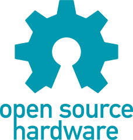

# OSH - HIL

# Install

## Linux

	git clone --recurse-submodules -j8 https://github.com/jed-frey/OSH-HIL.git
	cd OSH-HIL
	make -j2 artifacts

## Kvaser Leaf Light

	cd artifacts/linuxcan	
	make -j8
	make install

	cp 10-kvaser.rules /etc/udev/rules.d/
	udevadm control --reload-rules && udevadm trigger
