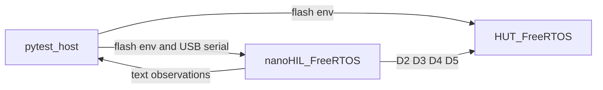

# nano4I4O HIL and HUT smoke bench

## Decisions from the questionnaire

- Deliver StrictDoc requirements plus a runnable skeleton: PlatformIO projects, pytest flash fixtures, and [`HIL/README.md`](HIL/README.md). There is no project-root README and no `docs/nanoHIL.md`.
- Both boards are the classic Arduino Nano, ATmega328P, PlatformIO board `nanoatmega328`. FreeRTOS uses static allocation and two tasks sized for 2 KB SRAM. The board id stays `nanoatmega328` even if the link is tight.
- The four wires are digital GPIO: HIL D2–D5 tied to HUT D2–D5, plus a shared GND. USB serial on each Nano stays with the host. D0/D1 are not part of the four-wire checkout.
- Each hardware test names a PlatformIO environment. The fixture flashes that environment, then opens the serial port.
- The HIL reports observations as USB serial text lines. Python is the pass/fail oracle.
- Ports come from `--hil-port` and `--hut-port`, falling back to `NANO_HIL_PORT` and `NANO_HUT_PORT`.
- Hardware tests fail when either port is missing, cannot be opened, or the bench does not answer. They are not skipped.
- Requirements SHALL follow [`.cursor/rules/requirements/mil-std-498-strictdoc/`](.cursor/rules/requirements/mil-std-498-strictdoc/). The set to write is OCD, SSS, SRS, IRS, SDD, STP, and STD. SSS is the System/Subsystem Specification. SRS is the Software Requirements Specification. STP is the Software Test Plan. STD is the Software Test Description. Sources live under [`reqs/`](reqs/) and HTML under [`reqs/html/`](reqs/html/). Doorstop YAML is not used.
- Each firmware image has two FreeRTOS tasks: one IO checkout task and one USB serial report task.

Still assumed, because they were not in the questionnaire: 115200 8N1, the driving image stays silent, 10 ms settle after a drive change, and a failed flash fails that test.

## Bench

In this project the HUT is a second Nano so the four wires can be checked without a product. The requirements state that a later bench attaches real hardware to the same nanoHIL pins. dSPACE stays for larger HIL jobs; nanoHIL is the smoke bench.

## Layout

All of this lives under `/projects/OSH-HIL/nano4I4O`.

- `plans/` — this plan, saved first and tracked in git.
- `reqs/` — one StrictDoc file per selected MIL-STD-498 document type, copied from the template titles in `.cursor/rules/requirements/mil-std-498-strictdoc/` and filled for nano4I4O. `reqs/strictdoc.toml` sets `html_root` to `reqs/html`.
- `HIL/` — PlatformIO + FreeRTOS nanoHIL. `HIL/README.md` lists every Nano IO a smoke bench can use (power, D0–D13 with UART/SPI/PWM notes, A0–A7 with I2C on A4/A5, reset) and says this replaces multi-thousand-dollar benches for smoke tests. It also marks D2–D5 as the nano4I4O checkout wires.
- `HUT/` — PlatformIO + FreeRTOS hardware-under-test image.
- `nano4i4o/` — Python package at the project root (no Python `src/` tree): catalog, flash, serial-line parser, Click CLI.
- `tests/` — pytest. `Makefile`, `pyproject.toml`, `.gitignore`.

PlatformIO’s own `HIL/src` and `HUT/src` stay; that is the PlatformIO layout, not a Python `src/` tree.

## Requirements to write

nano4I4O requirements SHALL follow `.cursor/rules/requirements/mil-std-498-strictdoc/`. Each file keeps that template's `[DOCUMENT]` title and is filled with testable statements, parent links, and acceptance text.

- **OCD** — operational concept: nanoHIL is the inexpensive smoke bench that stands in for a multi-thousand-dollar tester; this project checks four wires with a second Nano as the HUT; later the real device attaches to the same nanoHIL pins; dSPACE remains for larger HIL work.
- **SSS** — two ATmega328P Nanos, four cross-wired digital IO, shared ground, nanoHIL checks out the attached device, the host orchestrates.
- **SRS** — pytest discovers HIL and HUT PlatformIO environments, maps each test to one HIL env and one HUT env, flashes both, resolves ports from the CLI or the environment variables, parses HIL text, and fails the test when a port is missing or the bench does not answer.
- **IRS** — pin interface D2–D5 and the HIL text protocol (`READY`, `SAMPLE <pin> <0|1>`, `DONE`).
- **SDD** — two FreeRTOS tasks per image; Python modules; fixture order (upload HUT, upload HIL, open the reporter serial, assert samples).
- **STP / STD** — one checkout where the HUT walks a known pattern and the HIL samples it; one swapped pair where the HIL drives and the HUT is the reader. Parser and catalog tests do not need boards. The checkout tests fail without the bench.

Requirement IDs go in firmware and Python comments. `make strictdoc-validate` and `make strictdoc-generate` run before commit. A repo copy of the pre-commit hook regenerates HTML when `.sdoc` files are staged; HTML is committed with the sources.

## Firmware and pytest behavior

`HIL/platformio.ini` and `HUT/platformio.ini` use `framework = arduino`, `board = nanoatmega328`, and a FreeRTOS library with static allocation. Environments (initial set):

- HIL `read_d2_d5` — inputs, sample task, serial task prints levels.
- HUT `drive_walk` — outputs, walks a fixed pattern on D2–D5.
- HIL `drive_walk` and HUT `read_d2_d5` — the swapped pair, so each side’s IO is checked as an output and as an input.

`nano4i4o` reads both `platformio.ini` files and a small case table (test id, hil env, hut env, expected samples). Pytest parametrizes hardware tests from that table. The firmware fixture shells out to `pio run -t upload` with the selected env and `--upload-port`. The same functions sit behind a Click CLI (`nano4i4o flash`) so a person can flash one board without pytest.

Hardware tests fail when `--hil-port` / `--hut-port` are unset and `NANO_HIL_PORT` / `NANO_HUT_PORT` are also unset, when a port cannot be opened, or when the reporter does not emit the expected text. Parser and catalog tests cover the Python package, including the missing-port failure, so coverage can reach 80 percent without a Nano attached. `make test` runs the full suite, so it fails off the bench.

## Tooling required by the cursor rules

- `Makefile`: `help`, `clean`, `build` (both PlatformIO projects), `test` (full pytest; fails without the bench), `run`, plus `strictdoc-init`, `strictdoc-generate`, `strictdoc-validate`, `strictdoc-export`, `strictdoc-serve`, `strictdoc-tree`, `strictdoc-help`.
- Python 3.10+ via `uv` in a project virtualenv. `pyproject.toml` holds metadata, pytest, coverage (`fail_under = 80`), and ruff. No `setup.py`.
- `.gitignore` includes LaTeX artifact patterns, `.pio/`, the project virtualenv, and Python caches. `plans/` is not ignored.

## Git during execution

Commits follow `.cursor/rules/git/`, including atomic commits after each created file, the five-dash commit format, upstream fetch before commit, and push when a remote exists. The git root is `/projects/OSH-HIL`. Local `user.name` / `user.email` are set the way `git/user-config.mdc` requires, for this repo only.
